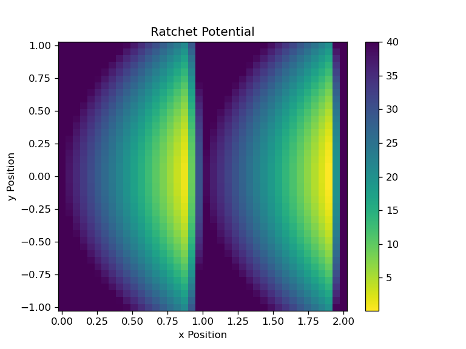
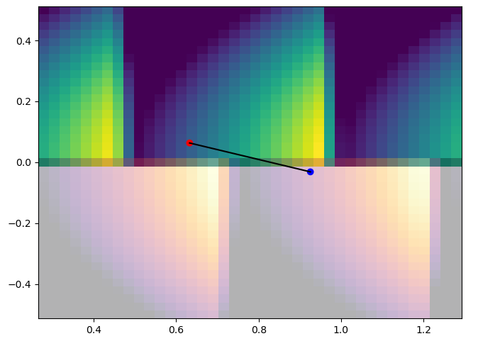

# Molecular motor hand-over-hand
Inspired by classes of Biological Physics given by [F.Falo](https://journals.aps.org/search/results?sort=relevance&clauses=%5B%7B%22operator%22%3A%22AND%22%2C%22field%22%3A%22author%22%2C%22value%22%3A%22F+Falo%22%7D%5D) at Universidad de Zaragoza (UNIZAR) during 2022.

Simple implementation of a flashing ratchet model in two dimensions on two headead molecule (red and blue heads). Each head experiences a flashing ratchet potential in which the minimum are not aligned. 

This model shows how a intermittent potential with brownian motion can cause net fordward motion.

# How to use
## Potential visualization
In the Jupyther notebook there is an explanation of the two dimentional ratchet potential implementation. In two dimensions and as a three dimensional surface.

## Simulation
In the simulation you can see the 2 heads of the molecule, blue and red, connected with a highly stiff spring (in black).

The plot is divided in two backgrounds, bluish and reddish, each one represents the potential affectig the same coloured head. When the backgroud is semi-transparent the potential is not active and the movement of the head is only limited by the spring.

# Configuration
All configurable variables are in `main.py` file:

*   `period`: potentials flashing period.
*   `length_potential`: length of ratchet potential in x axis.
*   `low_point_potential`: position of lowest potential value, must be lower than `length_potential`.
*   `potential_offset`: offset between red and blue head ratchet potential lowest position in x axis.

*   `max_value_potential`: difference between lowest and highest values of ratchet potential.
*   `confinement_potential_coefficient`: spring constant.

*   `steps_per_frame`: integrations steps per frame.
*   `frames_per_second`: frames per second.

# Reference
J.Munárriz, J.J. Mazo and F.Falo. *"Model for hand-over-hand motion of molecular motors"*. Physical Review E 77, 031915. 17 March 2008.

